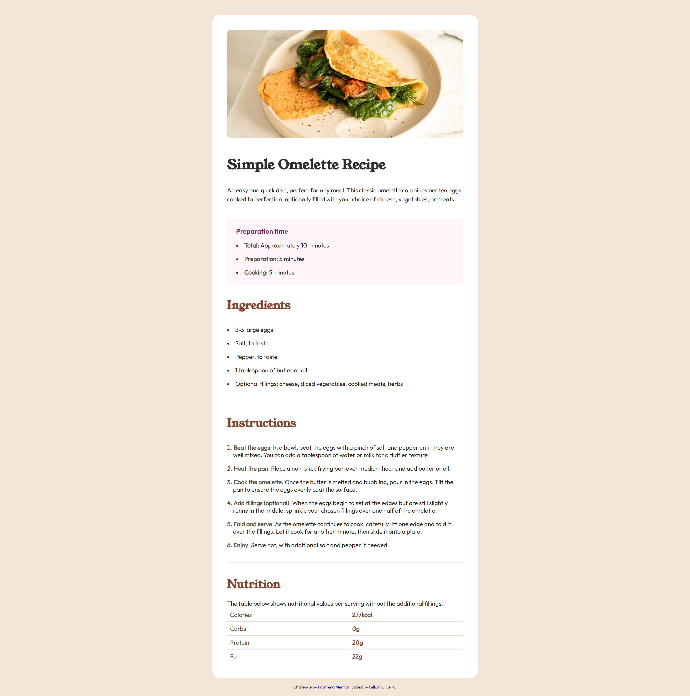

<h1> Frontend Mentor - Recipe page solution</h1>

This is a solution to the [Recipe page challenge on Frontend Mentor](https://www.frontendmentor.io/challenges/recipe-page-KiTsR8QQKm). Frontend Mentor challenges help you improve your coding skills by building realistic projects.

<h2> Table of contents</h2>

- [Overview](#overview)
  - [Screenshot](#screenshot)
  - [Links](#links)
- [My process](#my-process)
  - [Built with](#built-with)
  - [What I learned](#what-i-learned)
  - [Continued development](#continued-development)
- [Author](#author)

## Overview

### Screenshot

Preview design:


My solution:


### Links

- Solution URL: [Recipe Page Repo](https://github.com/lia-oliveira/recipe-page)
- Live Site URL: [Recipe Page Live](https://your-live-site-url.com)

## My process

### Built with

- Semantic HTML5 markup
- CSS custom properties
- Mobile-first workflow
- Flexbox
- Media Queries


### What I learned

I learned a lot from this project, and I will highlight two key points below:

1. How to make list markers stay inside the container.
```css
ul, ol {
  list-style-position: inside;
}
```

2. How to use a selector that applies styles to the first child of a specific type.

```css
.container > p:first-of-type {
  /* property: value; */
}
```


### Continued development

I plan to study ways to automate the calculation of margins, paddings, and other measurements, at least during the development phase. Using the CSS calc() function could be a good approach, as recalculating everything manually after each change is tedious and unproductive.

Additionally, I need a Pro account on Frontend Mentor. Not having access to the Figma files makes even simple projects like this take considerably more time to complete.

## Author

- Website - [Github](https://github.com/lia-oliveira)
- Frontend Mentor - [@lia-oliveira](https://www.frontendmentor.io/profile/lia-oliveira)


